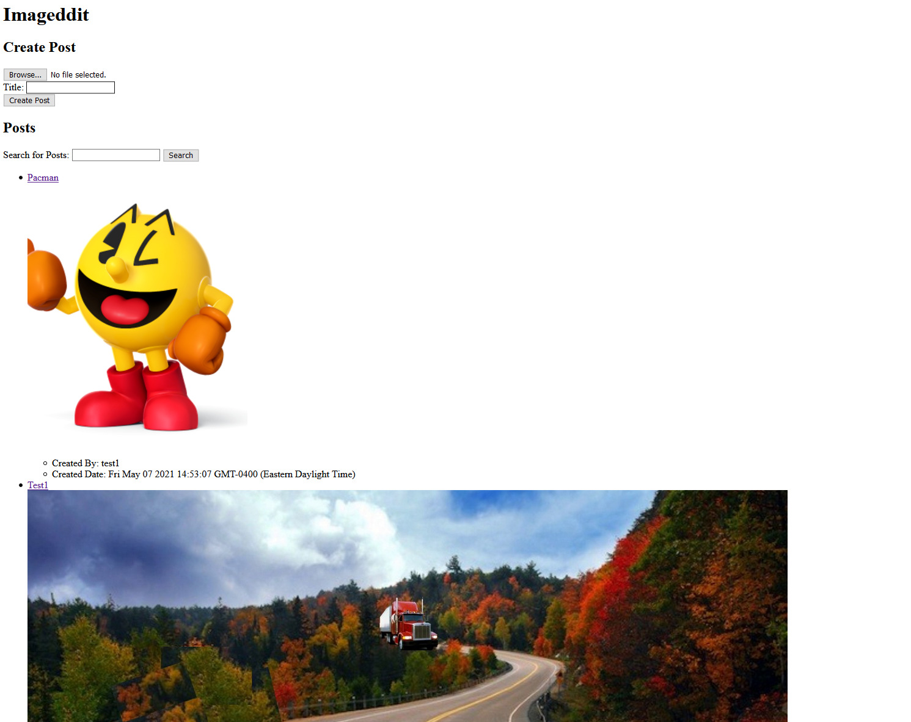
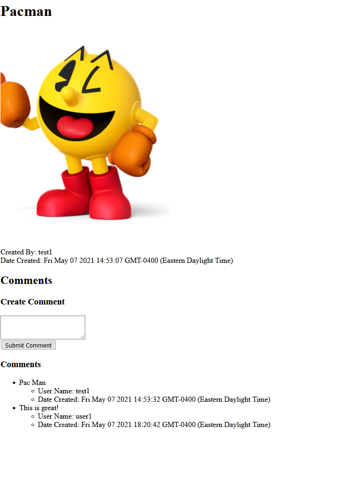

# How to use this application

After setting up the application, the app should be available in `localhost:3000`.

1. Create a new account  

2. Enter a username and password to create a new account  

3. Login with the newly created account  

4. This brings you to the home page, where you can upload your own images and search for other people's images  

5. You can click on the title of any image and leave comments on the image  

